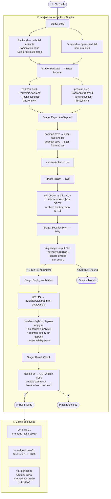

# 🛡️ Exail Edge V2 — DevSecOps POC

> Pipeline CI/CD air-gapped complet avec hardening ANSSI, scan de vulnérabilités, génération SBOM et déploiement Ansible sur infrastructure multi-VM Libvirt/Vagrant.


---

## Table des matières

1. [Vue d'ensemble](#vue-densemble)
2. [Architecture](#architecture)
3. [Pipeline CI/CD](#pipeline-cicd)
4. [Stack applicative](#stack-applicative)
5. [Hardening & Sécurité](#hardening--sécurité)
6. [Stack Observabilité](#stack-observabilité)
7. [Prérequis & Installation](#prérequis--installation)
8. [Utilisation](#utilisation)
9. [Config Manager (Streamlit)](#config-manager-streamlit)
10. [Gestion des CVE](#gestion-des-cve)

---

## Vue d'ensemble

Ce dépôt est une preuve de concept DevSecOps pensée pour un environnement **air-gapped** (sans accès Internet sur les cibles), inspiré des contraintes opérationnelles défense/industrie.

**Ce que démontre ce POC :**

- Build d'images conteneurs Podman avec compilation C++/CMake multi-stage et build Vue.js en CI
- Export des images en archives `.tar` pour transfert air-gapped (aucun registry requis sur les cibles)
- Génération automatique de **SBOM au format SPDX-JSON** via Syft à chaque build
- Scan de vulnérabilités **Trivy** sur archives — pipeline bloquant sur `CRITICAL` non corrigées
- Déploiement **Ansible** avec hardening OS conforme aux recommandations **ANSSI**
- Stack d'observabilité complète : Grafana + Prometheus + Loki + Node Exporter + cAdvisor + Promtail
- **Config Manager** Streamlit pour la génération dynamique des fichiers Ansible et le monitoring d'infrastructure

---

## Architecture

### Infrastructure Vagrant / Libvirt

| VM | Hostname | IP | Rôle |
|---|---|---|---|
| `vm-jenkins` | `vm-jenkins` | `10.0.0.10` | Orchestrateur CI/CD — Jenkins + Podman + Ansible + Syft |
| `vm-prod` | `vm-prod-01` | `10.0.0.11` | Cible production — Frontend Vue.js (Nginx rootless) |
| `vm-drone` | `vm-edge-drone-01` | `10.0.0.12` | Cible edge — Backend C++ (Distroless/Nonroot) |
| `vm-monitoring` | `vm-monitoring` | `10.0.0.13` | Observabilité — Grafana, Prometheus, Loki |

Toutes les VMs sont sur le réseau privé Libvirt `exail-v2-net`. La communication CI→cibles se fait exclusivement par **SSH avec clé Ed25519** (pas de mot de passe).

### Topologie réseau

```
  ┌─────────────────────────────────────────────────────┐
  │               exail-v2-net (10.0.0.0/24)            │
  │                                                     │
  │  ┌──────────────┐      SSH + Ansible                │
  │  │  vm-jenkins  │ ──────────────────────────────┐   │
  │  │  10.0.0.10   │                               │   │
  │  │  Jenkins     │                    ┌──────────▼─┐ │
  │  │  Podman      │                    │  vm-prod   │ │
  │  │  Ansible     │                    │  10.0.0.11 │ │
  │  │  Syft        │                    │  Frontend  │ │
  │  └──────────────┘                    └────────────┘ │
  │         │                                           │
  │         │ SSH + Ansible          ┌──────────────┐   │
  │         └───────────────────────►│  vm-drone    │   │
  │         │                        │  10.0.0.12   │   │
  │         │                        │  Backend C++ │   │
  │         │                        └──────────────┘   │
  │         │                                           │
  │         │ SSH + Ansible          ┌──────────────┐   │
  │         └───────────────────────►│ vm-monitoring│   │
  │                                  │  10.0.0.13   │   │
  │                                  │  Grafana     │   │
  │                                  │  Prometheus  │   │
  │                                  │  Loki        │   │
  │                                  └──────────────┘   │
  └─────────────────────────────────────────────────────┘
```

---

## Pipeline CI/CD

### Vue d'ensemble du flux



### Détail des stages

#### Build
Le stage Backend se contente de nettoyer les artefacts locaux (`rm -rf backend/build`). La **compilation C++/CMake est intentionnellement déléguée au `Dockerfile.backend`** via un build multi-stage : cela garantit la reproductibilité de l'environnement de compilation et évite toute dépendance sur l'environnement local de l'agent Jenkins.

#### Package — Images Podman
Les images sont construites en **Podman rootless** sur `vm-jenkins`. Chaque image est labelisée avec :
- `git.commit` — SHA du commit source
- `git.branch` — branche d'origine
- `build.date` — timestamp ISO 8601
- `build.number` — numéro de build Jenkins

#### Export Air-Gapped
Les images sont exportées au format `docker-archive` via `podman save`. Ces archives sont le seul vecteur de transfert vers les VMs cibles — **aucun registry n'est requis**, ce qui est conforme au modèle air-gapped.

#### SBOM — Syft
Un **Software Bill of Materials** au format **SPDX-JSON** est généré pour chaque image. Ces fichiers sont archivés comme artefacts Jenkins et permettent la traçabilité de tous les composants logiciels embarqués.

#### Security Scan — Trivy
Scan sur archive `.tar` (compatible air-gapped). Le pipeline **bloque sur toute CVE CRITICAL non corrigée** (`--exit-code 1 --ignore-unfixed`). Les rapports JSON sont archivés même en cas d'échec (`allowEmptyArchive: true`). Voir section [Gestion des CVE](#gestion-des-cve) pour les exceptions documentées.

#### Deploy — Ansible
Trois rôles sont appliqués dans l'ordre :
1. `os-hardening` — sur toutes les cibles sauf monitoring
2. `podman-deploy` — déploiement des conteneurs air-gapped
3. `observability` — stack monitoring (agents sur prod/drone, serveur sur monitoring)

Le déploiement utilise `sshagent` avec la credential Jenkins `jenkins-ssh-key`.

---

## Stack applicative

### Backend C++ (`Dockerfile.backend`)

```
debian:bookworm-slim (builder)
  └── cmake + g++ + make
  └── cmake -B build -DCMAKE_BUILD_TYPE=Release
  └── cmake --build build
        │
        ▼
gcr.io/distroless/cc-debian12:nonroot (runtime)
  └── /app/exail_backend
  └── USER nonroot
  └── EXPOSE 9090
  └── HEALTHCHECK --health-check flag
```

- **Image runtime ~15 MB**, zéro shell, zéro package manager
- Exécuté en tant que `nonroot` (UID 65532)
- `--cap-drop ALL` appliqué au démarrage par Ansible

### Frontend Vue.js (`Dockerfile.frontend`)

```
node:20-alpine (builder)
  └── npm run build → /app/dist
        │
        ▼
nginx:stable-alpine (runtime)
  └── nginx.conf personnalisé (port 8080, server_tokens off)
  └── USER nginx (rootless)
  └── EXPOSE 8080
  └── apk upgrade --no-cache (patches Alpine au build)
  └── HEALTHCHECK GET /health
```

- Headers sécurité : `X-Frame-Options: SAMEORIGIN`, `X-XSS-Protection`
- `server_tokens off` — pas de divulgation de version Nginx
- `--cap-drop ALL` appliqué par Ansible

---

## Hardening & Sécurité

### Rôle `os-hardening` (ANSSI)

#### Kernel — sysctl

| Paramètre | Valeur | Justification |
|---|---|---|
| `net.ipv4.conf.all.accept_redirects` | `0` | Bloquer les redirections ICMP (MITM) |
| `net.ipv4.conf.all.send_redirects` | `0` | Désactiver l'émission de redirections |
| `net.ipv4.tcp_syncookies` | `1` | Protection SYN flood |
| `kernel.dmesg_restrict` | `1` | Restreindre l'accès aux logs kernel (fuite d'info) |
| `kernel.randomize_va_space` | `2` | ASLR complet |

#### SSH (`sshd_config`)

- `PermitRootLogin no`
- `PasswordAuthentication no` — clé uniquement
- Bannière légale `/etc/issue.net` : avertissement SYSTÈME RESTREINT EXAIL

#### Pare-feu UFW

| Port | Protocole | Cible | Service |
|---|---|---|---|
| 22 | TCP | Toutes | SSH |
| 8080 | TCP | Production | Frontend Nginx |
| 9090 | TCP | Edge | Backend C++ |
| 9100 | TCP | Prod/Edge | Node Exporter |
| 8081 | TCP | Prod/Edge | cAdvisor |
| 3000 | TCP | Monitoring | Grafana |
| 9090 | TCP | Monitoring | Prometheus |
| 3100 | TCP | Monitoring | Loki |

Politique par défaut : **DENY ALL inbound**.

#### Compte de service Podman

Les conteneurs sont lancés sous le compte `exail_svc` (shell `/sbin/nologin`, pas de login interactif). Rootless Podman : aucun démon root requis.

---

## Stack Observabilité

```
vm-prod-01  ──► node_exporter :9100 ──┐
vm-prod-01  ──► cadvisor :8081        ├──► Prometheus :9090 (vm-monitoring)
vm-edge-01  ──► node_exporter :9100 ──┤         │
vm-edge-01  ──► cadvisor :8081        ┘          ▼
                                             Grafana :3000 (vm-monitoring)

vm-prod-01  ──► promtail (journal) ──┐
vm-edge-01  ──► promtail (journal) ──┴──► Loki :3100 (vm-monitoring)
                                              │
                                              ▼
                                         Grafana :3000
```

### Composants

| Composant | Rôle | Port |
|---|---|---|
| **Prometheus** | Scrape métriques (15s interval) | 9090 |
| **Grafana** | Dashboards — source Prometheus + Loki | 3000 |
| **Loki** | Agrégation logs | 3100 |
| **Node Exporter** | Métriques système OS | 9100 |
| **cAdvisor** | Métriques conteneurs Podman | 8081 |
| **Promtail** | Collecte `systemd-journal` → Loki | — |

Promtail est configuré pour relabeler `__journal__systemd_unit` → `unit`, ce qui permet le filtrage par service dans Grafana/Loki.

---

## Prérequis & Installation

### Dépendances hôte

```bash
# Vagrant + Libvirt
sudo apt install vagrant vagrant-libvirt libvirt-daemon-system

# Ansible + collections
pip install ansible ansible-lint
ansible-galaxy collection install ansible.posix community.general containers.podman

# Syft (SBOM)
curl -sSfL https://raw.githubusercontent.com/anchore/syft/main/install.sh | sh -s -- -b /usr/local/bin

# Streamlit (Config Manager, optionnel)
pip install streamlit pyyaml pandas
```

### Démarrage de l'infrastructure

```bash
# Cloner le dépôt
git clone https://github.com/clementtrecourt/Exail-poc.git exail-v2
cd exail-v2/infra/vagrant

# Démarrer toutes les VMs
vagrant up

# Vérifier l'état
vagrant status
```

> ⚠️ Le provisionnement de `vm-jenkins` installe Jenkins, ses plugins, Podman, Ansible, Syft et configure les namespaces utilisateur pour le rootless. Prévoir ~5 min.

### Configuration Jenkins post-install

1. Récupérer le mot de passe initial :
   ```bash
   vagrant ssh vm-jenkins -c "sudo cat /var/lib/jenkins/secrets/initialAdminPassword"
   ```
2. Ouvrir Jenkins sur `http://10.0.0.10:8080`
3. Ajouter la credential SSH `jenkins-ssh-key` (type *SSH Username with private key*) avec la clé privée de Jenkins
4. Créer un job Pipeline pointant sur ce dépôt, type *Pipeline from SCM*

### Clé SSH Jenkins → VMs cibles

```bash
# Sur vm-jenkins, générer une clé Ed25519
sudo -u jenkins ssh-keygen -t ed25519 -C "jenkins-deploy" -f /var/lib/jenkins/.ssh/id_ed25519 -N ""

# Copier la clé publique dans le Vagrantfile (section vm-prod provision shell)
# puis mettre à jour authorized_keys sur vm-drone et vm-monitoring de la même façon
sudo -u jenkins cat /var/lib/jenkins/.ssh/id_ed25519.pub
```

---

## Utilisation

### Lancer un déploiement complet

```bash
# Via Jenkins UI : Build Now sur le job configuré
# Ou via CLI Jenkins (si jenkins-cli.jar installé) :
java -jar jenkins-cli.jar -s http://10.0.0.10:8080 build <job-name> -v
```

### Déploiement Ansible manuel (hors Jenkins)

```bash
cd exail-v2

# S'assurer que les archives existent dans roles/podman-deploy/files/
ls ansible/roles/podman-deploy/files/

# Lancer uniquement le hardening
ansible-playbook -i ansible/inventory/production.ini ansible/deploy-app.yml \
  --tags os-hardening

# Déploiement complet
ansible-playbook -i ansible/inventory/production.ini ansible/deploy-app.yml -v
```

### Vérifications post-déploiement

```bash
# Health check frontend
curl http://10.0.0.11:8080/health
# → OK

# Health check backend
vagrant ssh vm-drone -c "podman exec exail-backend /app/exail_backend --health-check"
# → STATUS: OK

# Grafana
open http://10.0.0.13:3000
# admin / admin (changer au premier login)
```

---

## Config Manager (Streamlit)

`config_builder.py` est une application **Streamlit** permettant de :

- **Monitorer l'infrastructure** en temps réel (ping ICMP + TCP connect sur tous les ports exposés, avec auto-refresh 30s optionnel)
- **Générer les fichiers Ansible** (`inventory/production.ini` et `group_vars/all.yml`) depuis une interface graphique avec validation des IPs/ports
- **Visualiser un récapitulatif** de l'état de tous les hosts sous forme de tableau

```bash
# Lancer depuis la racine du projet
streamlit run config_builder.py
# → http://localhost:8501
```

L'application écrit directement les fichiers générés dans `ansible/inventory/` et `ansible/group_vars/` du projet.

---

## Gestion des CVE

### Politique générale

Le pipeline Trivy est configuré en mode **strict** :

```
--severity CRITICAL --ignore-unfixed --exit-code 1
```

Seules les CVE **CRITICAL** pour lesquelles un correctif existe bloquent le pipeline. Les CVE sans correctif disponible upstream (`--ignore-unfixed`) sont exclues du critère de blocage mais restent visibles dans les rapports JSON archivés.

### Exception documentée — CVE-2026-0861

| Champ | Valeur |
|---|---|
| **CVE** | CVE-2026-0861 |
| **Fichier** | `.trivyignore` |
| **Image concernée** | `exail-backend` (base `distroless/cc-debian12`) |
| **Sévérité** | HIGH |
| **Statut upstream** | Pas de correctif disponible au moment du build |

**Justification d'acceptation du risque :**

Cette CVE affecte une bibliothèque système de l'image de base `gcr.io/distroless/cc-debian12`. Elle a été évaluée selon les critères suivants :

1. **Surface d'exposition** : l'image distroless ne contient ni shell, ni interpréteur, ni gestionnaire de paquets. Le vecteur d'exploitation nécessite une exécution de code arbitraire préalable, qui est impossible dans ce contexte.
2. **Isolation réseau** : les conteneurs s'exécutent dans un environnement air-gapped avec UFW `DENY ALL` par défaut ; seul le port 9090 est accessible depuis le réseau privé.
3. **Absence de correctif** : aucun patch n'est disponible dans Debian 12 au moment de la décision. Le risque résiduel est jugé acceptable en attendant un correctif upstream.
4. **Traçabilité** : la décision est enregistrée dans `.trivyignore` avec le numéro de CVE explicite. Les rapports Trivy JSON complets restent archivés dans Jenkins pour audit.

**Action de suivi** : surveiller les advisories Debian/distroless et retirer l'exception dès qu'un correctif est disponible.

---

## Structure du dépôt

```
exail-v2/
├── ansible/
│   ├── deploy-app.yml                  # Playbook principal (3 rôles)
│   ├── inventory/
│   │   └── production.ini              # Inventaire 4 VMs
│   ├── group_vars/
│   │   └── all.yml                     # Variables globales
│   └── roles/
│       ├── os-hardening/               # Hardening ANSSI (sysctl, SSH, UFW, bannière)
│       ├── podman-deploy/              # Déploiement air-gapped (load + run)
│       └── observability/              # Stack monitoring (agents + serveur central)
├── backend/
│   └── src/main.cpp                    # Backend C++ edge simulé
├── frontend/
│   ├── nginx.conf                      # Nginx rootless port 8080
│   └── package.json
├── infra/
│   └── vagrant/
│       └── Vagrantfile                 # 4 VMs Libvirt (jenkins, prod, drone, monitoring)
├── Dockerfile.backend                  # Multi-stage debian → distroless/nonroot
├── Dockerfile.frontend                 # Multi-stage node:alpine → nginx:stable-alpine
├── Jenkinsfile                         # Pipeline 7 stages
├── config_builder.py                   # Config Manager Streamlit
├── .trivyignore                        # CVE documentées et justifiées
└── .dockerignore
```
